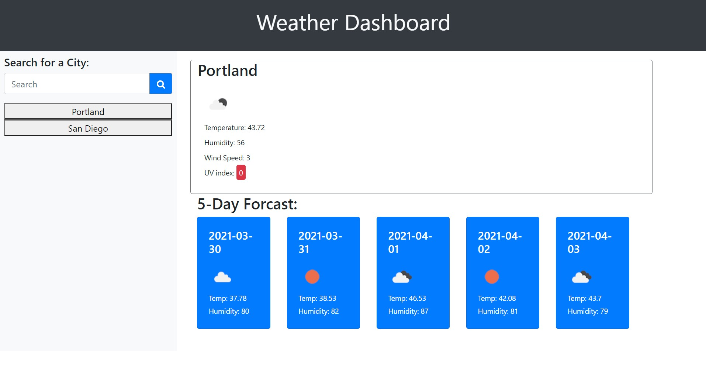

# Weather-Dashboard

[![LinkedIn][linkedin-shield]][linkedin-url]

https://unduhduhsea.github.io/Weather-Dashboard/

## About The Project

This project is a weather app. The user can input any city in the United States and the website will return
today's weather and the weather for the next 5 days. Every search that is made will be saved in local storage. The saved searches turn into buttons that you can use to repopulate the weather data. 

### Built With

    -HTML
    -CSS
    -JavaScript
    -jQuery
    -Bootstrap
    -https://openweathermap.org/api

## Contact

Tyler Abegg - [@SeaDuh](https://twitter.com/SeaDuh) - tafimba@gmail.com

<!-- MARKDOWN LINKS & IMAGES -->
[linkedin-shield]: https://img.shields.io/badge/-LinkedIn-black.svg?style=for-the-badge&logo=linkedin&colorB=555
[linkedin-url]: www.linkedin.com/in/tyler-abegg
[product-screenshot]: images/screenshot.png